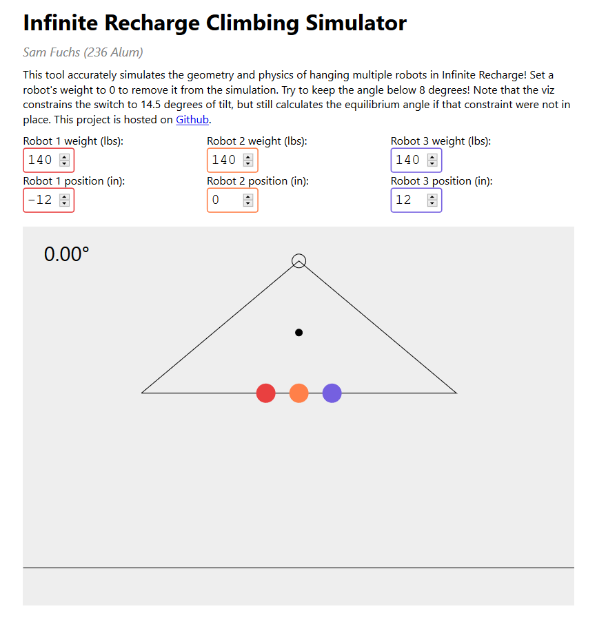

# Infinite Recharge Climbing Simulator

A simple tool to help FRC teams simulate the behavior of the climbing bar in
FIRST Infinite Recharge. This physics simulator finds and visualizes the
equilibrium balance of the generator switch with up to three robots of different
weights hanging on it at different points. You can use this for planning your
climbs with your alliance, or to help you understand how to build your climber!
Feel free to contact me with any questions.

## Upcoming Features

- Height displays
- Drag and drop robot positions
